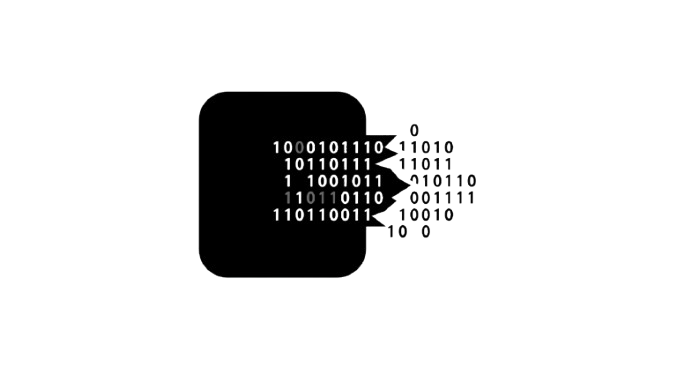

# BytePurge



BytePurge is a lightweight, user-friendly desktop application designed to help users identify and safely remove unnecessary files from their system. Using an intelligent scoring system based on file age and type, it prioritizes files that are likely to be safe for deletion—such as old executables, archives, logs, and temporary files—helping free up valuable disk space without risking important data loss.

## Features

- **Multi-threaded folder scanning** for fast, efficient cleanup.  
- **File scoring system** based on age and extension to highlight files safe for removal.  
- **Interactive GUI** to select folders, view file details, and delete files.  
- **Live CPU and GPU usage monitoring** shown in the window title.  
- **Export and clear logs** for audit and tracking.  
- **Progress bars and detailed status messages** for clear user feedback.

### Source Code

- [GitHub Repository](https://github.com/Vvoidddd/BytePurge)

## Requirements

- Windows 10 or higher  
- Python 3.7+  
- Packages: `pyqt6`, `psutil`, `gputil`

## Installation

1. **Run `installer.bat`** included to automatically install dependencies and launch the app.  
2. Or install packages manually:  
   ```bash
   python -m pip install pyqt6 psutil gputil
````

3. Launch the app:

   ```bash
   python main.py
   ```

## Usage

1. Click **Select Folder** to choose a directory to scan.
2. Click **Scan** to analyze files for potential cleanup.
3. Review the files and their scores.
4. Select files to delete and click **Delete Selected**.
5. Export or clear logs as needed.

## Contributing

Contributions and suggestions are welcome. Please open issues or pull requests on the GitHub repository.

